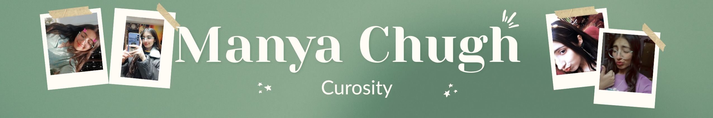

# 👋 Hi, I'm Manya Chugh

**A Passionate Developer | Lifelong Learner | Problem Solver**

*Curiosity is the secret to developing new things. I'm passionate about learning new skills, which is why I chose this path.*

[GitHub](https://github.com/manyachugh1807) • [Portfolio](#) • [Email](mailto:manya.chugh1807@gmail.com)

## 🚀 About Me

Curiosity drives me to constantly explore new technologies and frameworks. While I may not have achieved major milestones yet, every project I build teaches me something valuable, and I'm proud of the progress I've made so far. I believe in continuous learning and pushing my boundaries every single day.

---

## 💻 Tech Stack

**Languages**

**Frontend**

**Backend & Tools**

---

## 📊 GitHub Stats

---

## 🎯 What I'm Currently Doing

- 🔨 **Building:** Full-stack projects using modern web technologies
- 📚 **Learning:** Advanced JavaScript, System Design, and Web Development Best Practices
- 🤝 **Open to:** Collaborating on exciting projects and contributing to open source
- 💬 **Ask me about:** Web development, coding challenges, or learning strategies

---

## 🏆 Featured Projects

| Project | Description | Tech Stack |
|---------|-------------|-----------|
| **[Project Name](link)** | Brief description of what this project does | React, Node.js, MongoDB |
| **[Project Name](link)** | Brief description of what this project does | JavaScript, HTML, CSS |
| **[Project Name](link)** | Brief description of what this project does | Python, Flask |

---

## 📈 Skills & Expertise
<ul>
    <li>Confident Speaker</li>
    <li>Curious to learn new thing</li>
    <li>Want to make my own startup</li>
    </ul>
---

## 🎓 Learning Goals for 2024

- ✅ Master full-stack development
- ✅ Contribute to open-source projects
- ✅ Build 5+ portfolio projects
- ✅ Improve system design skills
- ✅ Enhance problem-solving abilities

---

## 🔗 Connect With Me

---

## 💡 Fun Facts

- 🎮 I'm a gaming enthusiast and enjoy problem-solving games
- 🌙 I'm a night owl who codes best when the world is sleeping (or almost!)
- 📖 I love reading tech blogs and staying updated with industry trends
- ☕ Coffee and code are my best friends

---

### ⭐ If you find my work interesting, don't forget to star my repos!

**Thank you for visiting my profile! Happy coding! 🚀**

